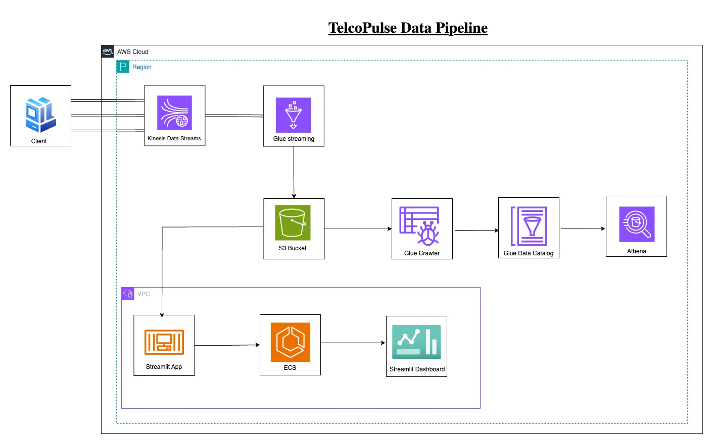

# TelcoPulse: Real-Time Network Metrics Dashboard<br>
## Overview<br>
TelcoPulse is a real-time analytics platform that monitors and analyzes network performance metrics from multiple mobile network providers. The system ingests streaming data, processes it in near real-time, and visualizes key performance indicators through an interactive dashboard.

## Architecture<br>


The solution leverages AWS-native services in a serverless architecture:

1. **Data Ingestion**: Amazon Kinesis for real-time data streaming
2. **Processing**: AWS Glue with Apache Spark for stream processing
3. **Storage**: Amazon S3 data lake for processed metrics
4. **Querying**: AWS Glue Crawlers and Athena for SQL access to data
5. **Visualization**: Streamlit dashboard deployed on Amazon ECS

## Key Features<br>
- Real-time monitoring of telecom network metrics
- Auto-refreshing dashboard with configurable intervals
- Interactive visualizations of key performance indicators
- Historical data analysis capabilities
- Scalable, cloud-native architecture

## Tools & Services Used

| Service | Purpose |
|--------|---------|
| **Amazon Kinesis Data Streams** | Ingest real-time network metric streams |
| **AWS Glue (Apache Spark Streaming)** | Process and transform incoming data |
| **Amazon S3** | Store transformed data as a data lake |
| **AWS Glue Crawlers** | Catalog data in S3 for queryability |
| **AWS Athena** | Query processed data using SQL |
| **Streamlit + Amazon ECS** | Host and serve a live-updating dashboard |

---

## Key Performance Indicators (KPIs)

1. **Average Signal Strength per Operator**  
2. **Average GPS Precision per Operator**  
3. **Count of Network Statuses per Postal Code**  

These metrics are updated every 5 minutes and displayed on a dynamic dashboard accessible to management for actionable insights.

---


## Deployment Instructions
### 1. Data Ingestion Setup
```bash
# Create Kinesis stream
aws kinesis create-stream --stream-name telco-network-metrics --shard-count 1

# Start streaming data (one-time activity)
python scripts/to_kinesis.py
```
### 2. Deploy AWS Glue Streaming Job
- Upload the `scripts/glue.py` script to an S3 bucket.
- Create a new AWS Glue Streaming job:
  - Use the uploaded script.
  - Set the Kinesis stream as the source.
  - Output transformed data to your S3 data lake bucket in Parquet format.
  - Enable job monitoring and logging.

### 3. Configure AWS Glue Crawler
- Create a crawler pointing to your S3 output bucket.
- Schedule the crawler to run periodically (e.g., every 5 minutes).
- The crawler will update the table schema in the AWS Glue Data Catalog.

Example Athena query:
```sql
SELECT operator, AVG(signal_strength) AS avg_signal
FROM network_metrics_table
GROUP BY operator;
```

### 4. Dashboard Deployment
 ```bash
# Build and push Docker image to ECR
docker build -t telcopulse-dashboard ./telcopulse_dashboard
aws ecr create-repository --repository-name telcopulse-dashboard
aws ecr get-login-password | docker login --username AWS --password-stdin <account-id>.dkr.ecr.<region>.amazonaws.com

docker tag telcopulse-dashboard:latest <account-id>.dkr.ecr.<region>.amazonaws.com/telcopulse-dashboard:latest
docker push <account-id>.dkr.ecr.<region>.amazonaws.com/telcopulse-dashboard:latest

# Deploy to ECS using AWS Console or CLI
```
### 5. Access the Dashboard:
 - Open a web browser and navigate to `{public IP}:8501`
 - View live-updated metrics refreshed every 5 minutes.

## 📈 Dashboard Features

- Auto-refreshes every 5 minutes to show latest metrics  
- Displays grouped bar charts and tables for each KPI  
- Responsive UI for viewing across devices  
- Dataset overview with total rows, columns, and memory usage  
- Data preview showing first few rows  
- Interactive visualizations (e.g., scatter plots)  
- Column statistics summary  

---


## Local Development

### Prerequisites
- AWS Account with appropriate permissions
- AWS CLI configured locally
- Docker installed (for local development)
- Python 3.11+

### Installation
 1. Clone the repository
 ```bash
git clone https://github.com/your-org/telcopulse.git
cd telcopulse
 ```

### Create and activate virtual environment
```bash
python -m venv venv
source venv/bin/activate  # On Windows: venv\Scripts\activate
```

### Install dependencies
```bash
pip install -r requirements.txt
```

### Run Streamlit app locally
```bash
cd telcopulse_dashboard
streamlit run app.py
 ```

### Using Docker
```bash
docker build -t streamlit-s3-dashboard .
docker run -p 8501:8501 --env-file .env streamlit-s3-dashboard
```

Dashboard will be available at: [http://localhost:8501](http://localhost:8501)

---

## Monitoring and Maintenance
 - Monitor Kinesis stream metrics in CloudWatch
 - Check Glue job execution logs for errors
 - Set up CloudWatch alarms for critical metrics
 - Regularly review S3 storage costs and implement lifecycle policies

## Security Considerations
 - Use IAM roles and policies for least privilege access
 - Enable VPC endpoints for S3 and Kinesis
 - Encrypt data at rest and in transit
 - Regularly rotate AWS access keys and secrets

## License
This project is licensed under the MIT License.
